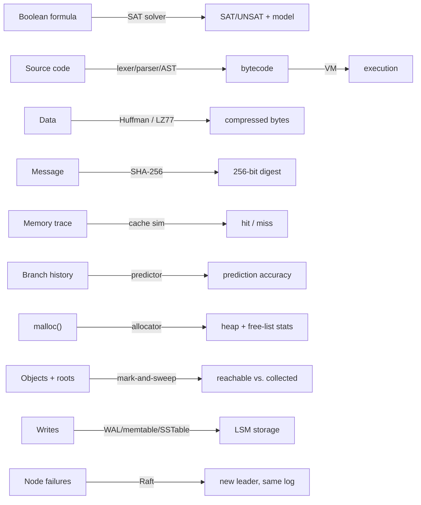

<div align="center">

# CS-Lab

### A hands-on laboratory for fundamental Computer Science — 19 small, hardened, real implementations, one measured experiment each, zero fabricated numbers.

**Twelve domains, from a DPLL SAT solver to a speculative-execution-safe compare, a hand-rolled SHA-256 to a Raft cluster that survives repeated leader failure. Every lab ships with its own tests, its own README, and its own real benchmark — run, read, and reproducible, not asserted.**


[](https://github.com/bhouvana/CS_Lab/actions/workflows/ci.yml)


</div>

---

## The one rule

**Nothing in this repo's docs is asserted without having actually run.** Every
benchmark table below was pasted from real `make benchmark` output. Every
"all tests passed" is a real exit code. Every "fixed" bug has a regression
test whose name says what it guards against. Where something wasn't
verified — a platform, a sanitizer, a claim — the docs say so instead of
staying quiet about it. `docs/reproducibility.md` names the exact machine,
compiler versions, and commands behind every claim in this file.

```text
UNDERSTAND -> IMPLEMENT -> EXPERIMENT -> MEASURE -> EXPLAIN
```

That loop, run once per lab, is the whole method. The full project
directive is [CS-LAB.md](CS-LAB.md); the reasoning behind "small over big"
is [docs/philosophy.md](docs/philosophy.md).

---

## Table of contents

- [What this repository is](#what-this-repository-is)
- [The labs, by domain](#the-labs-by-domain)
- [Six real results worth reading](#six-real-results-worth-reading)
- [Engineering rigor](#engineering-rigor)
- [Getting started](#getting-started)
- [Repository layout](#repository-layout)
- [Documentation index](#documentation-index)
- [Scope and what this deliberately is not](#scope-and-what-this-deliberately-is-not)
- [Relationship to Aegis-X86](#relationship-to-aegis-x86)
- [License](#license)

---

## What this repository is

A collection of small implementations that turn textbook Computer Science
into something you can run, break, and measure. Not tutorials that explain
a concept in prose — programs that *are* the concept, small enough to read
in one sitting (most labs sit under 300 lines of core logic) and instrumented
enough to produce a real number when you're done.

Every lab follows the same shape:

```text
<domain>/<lab>/
├── README.md    what it is · why it matters · design · build · usage ·
│                tests · benchmarks · failure behavior · limitations ·
│                what this intentionally does NOT do
├── include/     (C/C++) public header
├── src/         implementation + a bench.{c,cpp,py} that runs a real
│                experiment against it
├── tests/       assert-based tests: normal cases, edge cases, invalid
│                input, and — where a real bug was once found here — a
│                named regression test for it
└── examples/    sample input files the tests and benchmarks read
```

19 of the 20 labs scoped in [CS-LAB.md](CS-LAB.md) are built; the 20th
(`os/shell`) is honestly marked `planned, not yet implemented` in its own
README rather than either rushed out or silently dropped from the count.
See [docs/quality.md](docs/quality.md) for the per-lab scorecard.

---

## The labs, by domain

| Domain | Lab | Language | Concept |
|---|---|---|---|
| Algorithms | [SAT Solver](algorithms/sat-solver) | C++ | DPLL, unit propagation, the 3-SAT phase transition |
| Algorithms | [Graph Algorithms](algorithms/graph-algorithms) | C++ | BFS, DFS, Dijkstra, topological sort |
| Algorithms | [Bloom Filter](algorithms/bloom-filter) | Rust | Probabilistic set membership, false-positive theory |
| Compilers | [AtlasLang (Tiny Language)](compilers/tiny-language) | Rust | Lexer → parser → AST → tree-walking interpreter |
| Compilers | [Bytecode VM](compilers/bytecode-vm) | C | Stack machine, fetch/decode/execute, an assembler |
| Compression | [Huffman](compression/huffman) | C | Entropy coding, canonical codes |
| Compression | [LZ77](compression/lz77) | C++ | Dictionary/sliding-window compression |
| Cryptography | [SHA-256](crypto/sha256) | C | Hash function from scratch, verified against `sha256sum` |
| Architecture | [Cache Simulator](architecture/cache) | C++ | Direct-mapped / set-associative / LRU, hit-rate cliffs |
| Architecture | [Branch Predictor](architecture/branch-predictor) | C++ | 1-bit, 2-bit, gshare — same trace, different accuracy |
| Architecture | [Pipeline Simulator](architecture/pipeline) | Python | 5-stage pipeline, RAW hazards, forwarding, stalls |
| Runtimes | [Garbage Collector](runtimes/garbage-collector) | C | Mark-and-sweep, an iterative (not recursive) mark phase |
| Databases | [Tiny LSM](databases/tiny-lsm) | Rust | WAL, memtable, SSTables, compaction |
| Networking | [TCP Chat](networking/tcp-chat) | C | POSIX sockets, broadcast, graceful disconnect handling |
| Distributed Systems | [Raft Simulator](distributed/raft-simulator) | Rust | Leader election, log replication, deterministic recovery |
| Security | [Constant-Time Compare](security/constant-time) | C | Timing side channels, and their honest limits |
| Operating Systems | [Allocator](os/allocator) | C | malloc/free/realloc, splitting, coalescing, fragmentation |
| Operating Systems | [Shell](os/shell) | C | *planned, not yet built* |
| Assembly | [Calling Convention](assembly/calling-convention) | C + x86-64 ASM | System V ABI: argument/return registers, caller/callee-saved |
| Assembly | [Stack Frames](assembly/stack-frames) | C + x86-64 ASM | RSP/RBP, the red zone, a real stack-frame visualizer |
| Assembly | [Syscall Lab](assembly/syscall-demo) | C + x86-64 ASM | Raw Linux syscalls, kernel-crossing cost |



---

## Six real results worth reading

Every number below is in [docs/experiments.md](docs/experiments.md) with its
full table and method. A sample, not the whole set:

- **The SAT phase transition is directly visible.** Random 3-SAT
  satisfiability crosses 50% right at the theoretical ~4.267
  clause-to-variable ratio, and average backtracks *peak* there too — DPLL
  is measurably hardest exactly where SAT theory says it should be.
- **A cache's hit rate is a cliff, not a curve.** With 8 hot lines aliasing
  to one set, associativity 4 gives a 0.00% hit rate and associativity 8
  gives 99.50% — nothing in between softens the transition.
- **Freeing memory in the wrong order costs you the memory.** Freeing every
  other block leaves ~500KB free but scattered into 490 single-block holes;
  a 3KB *contiguous* request fails despite the free total. Freeing in LIFO
  order instead coalesces everything back to 0% fragmentation. Same bytes
  freed, opposite outcome.
- **A real function call beat compiler-inlined code — reproducibly.**
  `add2()` (a genuine `CALL`/`RET`) ran *faster* than `add_inline()`
  (verified via `objdump` to actually be inlined) because both loops were
  bottlenecked on store-to-load forwarding, and out-of-order execution hid
  the call's cost better than it hid the inlined version's scheduling.
  Confirmed with the loop order swapped before trusting the surprise.
  ([assembly/calling-convention](assembly/calling-convention))
- **A syscall costs ~534x a plain userspace call** (131ns vs. 0.2ns), even
  writing to `/dev/null` — the concrete answer to "why does libc buffer
  stdio instead of calling `write()` per byte."
- **Compaction made missing-key lookups ~20x faster** in the tiny LSM:
  collapsing 75 small, mostly-stale SSTables into 1 cut a 50x missing-key
  `get()` benchmark from 250ms to 12.6ms.

---

## Engineering rigor

This repository went through a dedicated hardening pass on top of the
original 20-lab build — not a rewrite, a pass to make what already worked
*provably* correct, reproducible, and defensive. The full record is
[docs/production-readiness.md](docs/production-readiness.md); the summary:

- **8 real bugs found, fixed, and permanently regression-guarded** — from an
  FNV-1a hash weakness inflating a bloom filter's false-positive rate, to a
  `SIGPIPE` silently killing a chat server on simultaneous disconnects
  (confirmed by disabling the fix and watching the test catch it), to a
  bytecode VM silently skipping an out-of-range opcode instead of rejecting
  it. Every one has a named test; the full table with fix location and
  test name is [docs/regressions.md](docs/regressions.md).
- **AddressSanitizer + UndefinedBehaviorSanitizer clean** on all 9 labs
  CS-LAB.md's own priority list names (`make sanitize`, or `make test-asan`
  per lab) — allocator, garbage collector, bytecode VM, SHA-256, Huffman,
  LZ77, TCP chat, SAT solver, constant-time compare.
  [docs/engineering-audit.md](docs/engineering-audit.md) has the per-lab
  detail, including what's *not* sanitizer-checked and why.
- **A deterministic fuzz test** (`compilers/bytecode-vm`): a fixed-seed
  xorshift32 PRNG generates 20,000 reproducible random programs — valid and
  invalid opcodes, random operands — and asserts the VM only ever returns 0
  or -1, never crashes. No libFuzzer in this environment, so this follows
  CS-LAB.md's own fallback: a deterministic malformed-input generator. The
  rest of the parsers (SAT's DIMACS reader, Huffman/LZ77's decoders,
  AtlasLang's lexer) already had deterministic malformed-input test cases
  from the original build — missing files, bad magic bytes, truncated
  headers, corrupt token streams, unknown mnemonics.
- **All 4 Rust crates are `cargo fmt --check` and `cargo clippy` clean**
  (one real `clippy::manual_div_ceil` warning fixed along the way).
- **Every randomized experiment is seeded and reproducible** — `mt19937(42)`
  in the SAT and branch-predictor benchmarks, a fixed xorshift32 seed in the
  VM fuzz test; Raft uses no randomness at all, by design (deterministic
  staggered election timeouts), specifically so cluster behavior reproduces
  run to run. Full seed list: [docs/reproducibility.md](docs/reproducibility.md).
- **Two real portability bugs found and fixed this pass**: a Makefile that
  only worked with `python`, not `python3` (reproduced the actual failure on
  stock Ubuntu); a benchmark reading `clock()` once per tiny operation,
  which reads 0.000ms on native Windows/MinGW's coarse clock resolution
  (reproduced, fixed by batching to a minimum elapsed time — the same
  pattern three other benchmarks already used).
- **Root `make` commands are honest about what they didn't run**: `make
  build`/`test`/`benchmark` print `skip: <lab> -- cargo not found on PATH`
  per Rust lab rather than aborting when Rust isn't installed; the four
  Linux-only labs print `skip: ... Linux/POSIX only` instead of failing on
  Windows. A skip is never silent and never counted as a pass.
- **A single-job CI workflow** (`.github/workflows/ci.yml`) runs `make
  build/test/format/lint/sanitize` on every push, on `ubuntu-latest` — which
  ships gcc/g++/make/python3 *and* cargo together, so it's the one place
  every lab, including the 4 Linux-only ones, builds and tests in one run.

---

## Getting started

```bash
git clone https://github.com/bhouvana/CS_Lab.git
cd CS_Lab

make build       # build every lab (skips Rust labs cleanly if cargo isn't on PATH)
make test        # run every lab's tests
make sanitize    # ASan+UBSan on the 9 priority labs (needs a Linux/glibc toolchain)
make format      # cargo fmt --check (Rust) + a clang-format report (C/C++, informational)
make lint        # cargo clippy -D warnings (Rust)
make check       # format + build + test — the fast local gate
make benchmark   # run every lab's real experiment
make clean
```

Each lab also builds and tests standalone from its own directory (`make` /
`make test` for C/C++/Python, `cargo test` for Rust) — no need to touch the
root Makefile just to work on one lab.

**Toolchain:** a C11/C++17 compiler (`gcc`/`g++` or `clang`), a POSIX `make`,
Rust + Cargo (stable), Python 3. On Windows, the Rust labs build natively;
everything else needs WSL or another Linux/POSIX environment — see
[docs/reproducibility.md](docs/reproducibility.md) for exactly which
toolchain was used where, and why root `make` can't exercise both halves in
one native-Windows run.

The three `assembly/*` labs and `networking/tcp-chat` are Linux
(x86-64, for the assembly labs specifically) only — their Makefiles detect
the platform and print a `skip:` line instead of building on anything else.
For the assembly labs this isn't a portability nicety: the hand-written code
assumes Linux-specific conventions (the System V calling convention, real
Linux syscall numbers) that would produce silently wrong results, not a
clean build failure, under a different ABI.

---

## Repository layout

```text
cs-lab/
├── README.md              this file
├── CS-LAB.md               the full project directive (scope, constraints, the 20-lab roadmap)
├── CONTRIBUTING.md
├── LICENSE                 MIT
├── Makefile                root build/test/benchmark/sanitize/format/lint/check
├── .clang-format           documented C/C++ style for new/touched code
├── .github/workflows/      CI (one ubuntu-latest job)
│
├── docs/
│   ├── philosophy.md            why "small over big"
│   ├── learning-path.md         a suggested reading order
│   ├── architecture.md          how the repo itself is organized
│   ├── experiments.md           every lab's real, measured results
│   ├── engineering-audit.md     per-lab build/test/sanitizer/portability status
│   ├── regressions.md           all 8 real bugs found, their fix, their guarding test
│   ├── reproducibility.md       exact toolchain versions, seeds, and commands
│   ├── quality.md               PASS/PARTIAL/N/A scorecard, 8 dimensions x 20 labs
│   └── production-readiness.md  what "production-ready" means here, and its limits
│
├── algorithms/       sat-solver · graph-algorithms · bloom-filter
├── compilers/        tiny-language · bytecode-vm
├── compression/      huffman · lz77
├── crypto/           sha256
├── architecture/     cache · branch-predictor · pipeline
├── runtimes/         garbage-collector  (stack-machine == compilers/bytecode-vm)
├── databases/        tiny-lsm
├── networking/       tcp-chat
├── distributed/      raft-simulator
├── security/         constant-time
├── os/               allocator · shell (planned)
└── assembly/         calling-convention · stack-frames · syscall-demo
```

---

## Documentation index

- **[CS-LAB.md](CS-LAB.md)** — the full project directive: scope, per-domain
  constraints, the language-per-lab rationale, the original 20-lab roadmap.
- **[docs/philosophy.md](docs/philosophy.md)** — why this repo optimizes for
  conceptual density over line count.
- **[docs/learning-path.md](docs/learning-path.md)** — a suggested order to
  read the labs in.
- **[docs/architecture.md](docs/architecture.md)** — how the repository
  itself is structured, and why.
- **[docs/experiments.md](docs/experiments.md)** — every lab's real,
  measured experiment, in one place.
- **[docs/engineering-audit.md](docs/engineering-audit.md)** — the hardening
  pass's baseline: per-lab build/test/sanitizer/fuzzing/portability status,
  and every finding that produced a code change.
- **[docs/regressions.md](docs/regressions.md)** — all 8 real bugs this
  project has found, each with its fix location and the exact test name
  that keeps it fixed.
- **[docs/reproducibility.md](docs/reproducibility.md)** — the exact
  machines, compiler versions, commands, and random seeds behind every
  claim in this repo's docs.
- **[docs/quality.md](docs/quality.md)** — the PASS/PARTIAL/N/A engineering
  scorecard, 8 dimensions across all 20 labs.
- **[docs/production-readiness.md](docs/production-readiness.md)** — what
  changed in the hardening pass, what "production-ready" means for this
  repo, and what limitations remain, stated plainly.
- **[CONTRIBUTING.md](CONTRIBUTING.md)** — how a new lab should be scoped
  and structured, if you're adding one.

Every individual lab's own `README.md` additionally documents its design,
build/usage instructions, failure behavior, limitations, and — explicitly —
what it intentionally does *not* do.

---

## Scope and what this deliberately is not

This is a laboratory, not a startup, and not an attempt at production
infrastructure. Explicitly out of scope, on purpose: a web UI, a database
beyond the LSM lab itself, authentication, cloud deployment, microservices,
a plugin system, or any dependency added to look sophisticated rather than
to solve a real problem. Terminal in, terminal out.

The implementations are educational: toy models and research prototypes,
not audited, production-grade, or cryptographically certified software —
the SHA-256 and constant-time-compare labs say so explicitly in their own
READMEs, and `docs/production-readiness.md` defines exactly what
"production-ready" is and isn't being claimed here. "Hardened" in this
repo's docs means *engineered to a high standard appropriate to its
educational scope* — deterministic, defensively tested, memory-safety
verified where a sanitizer applies, honestly documented about its limits —
not *a drop-in replacement for mature industrial software*.

## Relationship to Aegis-X86

[Aegis-X86](https://github.com/bhouvana/AEGIS-X86-Processor) (a separate
project) is the deep processor/microarchitecture laboratory: ISA design,
out-of-order execution, speculation, a real FPGA and open-PDK silicon flow.
CS-Lab is the broader map of CS fundamentals across twelve domains; the two
complement rather than duplicate each other — CS-Lab's `architecture/`
labs are a small, single-file-readable introduction to ideas Aegis-X86
implements at full scale in synthesizable hardware.

## License

[MIT](LICENSE).
